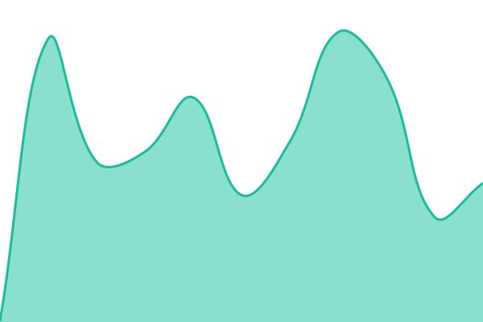

# [📈 Live Status](https://idiom22.github.io/status-page): <!--live status--> **🟩 All systems operational**

This repository contains the open-source uptime monitor and status page for [idiom22](https://idiom22.github.io/status-page), powered by [Upptime](https://github.com/upptime/upptime).

With [Upptime](https://upptime.js.org), you can get your own unlimited and free uptime monitor and status page, powered entirely by a GitHub repository. We use [Issues](https://github.com/idiom22/status-page/issues) as incident reports, [Actions](https://github.com/idiom22/status-page/actions) as uptime monitors, and [Pages](https://idiom22.github.io/status-page) for the status page.

<!--start: status pages-->
<!-- This summary is generated by Upptime (https://github.com/upptime/upptime) -->
<!-- Do not edit this manually, your changes will be overwritten -->
<!-- prettier-ignore -->
| URL | Status | History | Response Time | Uptime |
| --- | ------ | ------- | ------------- | ------ |
|  [Jellyfin](https://jellyfin.craigflix.net) | 🟩 Up | [jellyfin.yml](https://github.com/idiom22/status-page/commits/HEAD/history/jellyfin.yml) | 

 740ms
     
 | 

<a href="https://idiom22.github.io/status-page/history/jellyfin">100.00%</a>
    

|  [Craigflix](https://craigflix.net) | 🟩 Up | [craigflix.yml](https://github.com/idiom22/status-page/commits/HEAD/history/craigflix.yml) | 

 732ms
     
 | 

<a href="https://idiom22.github.io/status-page/history/craigflix">100.00%</a>
    

|  [Craigflix (www)](https://www.craigflix.net) | 🟩 Up | [craigflix-www.yml](https://github.com/idiom22/status-page/commits/HEAD/history/craigflix-www.yml) | 

 667ms
     
 | 

<a href="https://idiom22.github.io/status-page/history/craigflix-www">100.00%</a>
    

|  [Tracearr](https://tracearr.craigflix.net/) | 🟩 Up | [tracearr.yml](https://github.com/idiom22/status-page/commits/HEAD/history/tracearr.yml) | 

 308ms
     
 | 

<a href="https://idiom22.github.io/status-page/history/tracearr">100.00%</a>
    

|  [Seerr](https://requests.craigflix.net/) | 🟩 Up | [seerr.yml](https://github.com/idiom22/status-page/commits/HEAD/history/seerr.yml) | 

 1075ms
     
 | 

<a href="https://idiom22.github.io/status-page/history/seerr">100.00%</a>
    

<!--end: status pages-->

[**Visit our status website →**](https://idiom22.github.io/status-page)

## 📄 License

- Powered by: [Upptime](https://github.com/upptime/upptime)
- Code: [MIT](./LICENSE) © [Anand Chowdhary](https://anandchowdhary.com)
- Data in the `./history` directory: [Open Database License](https://opendatacommons.org/licenses/odbl/1-0/)
